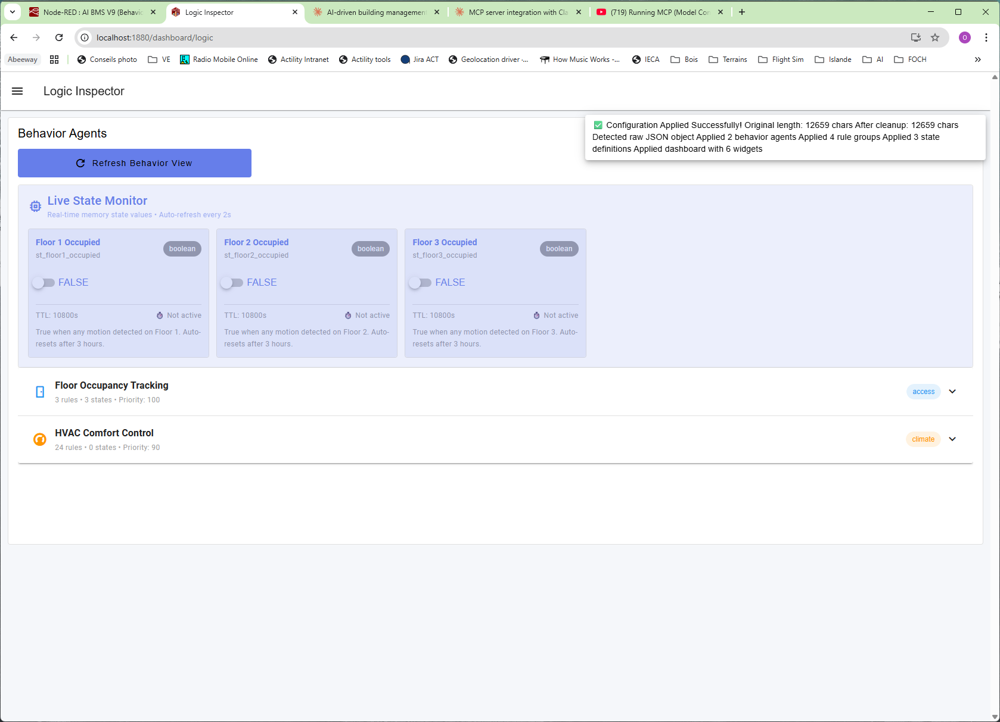
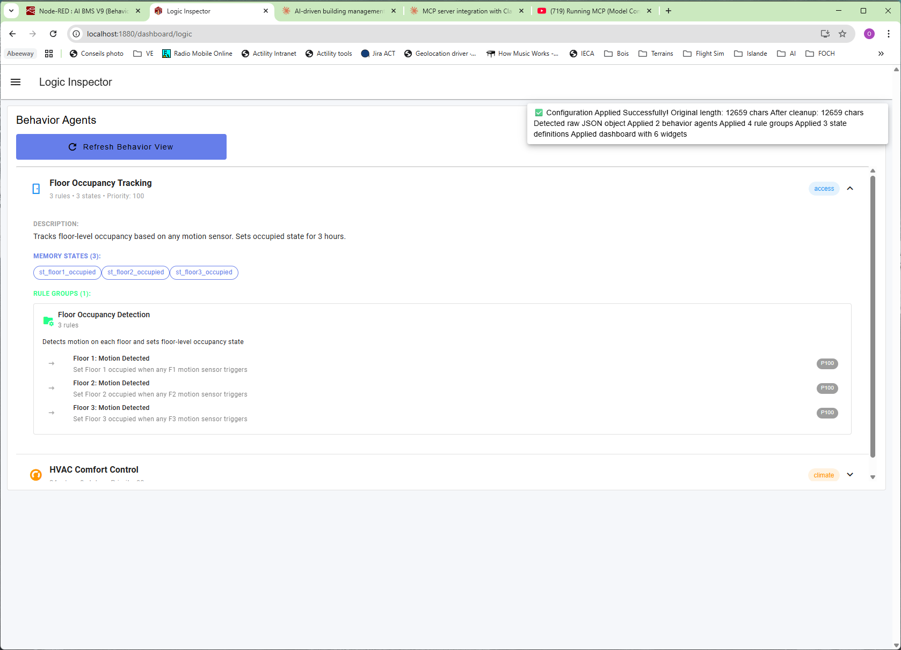
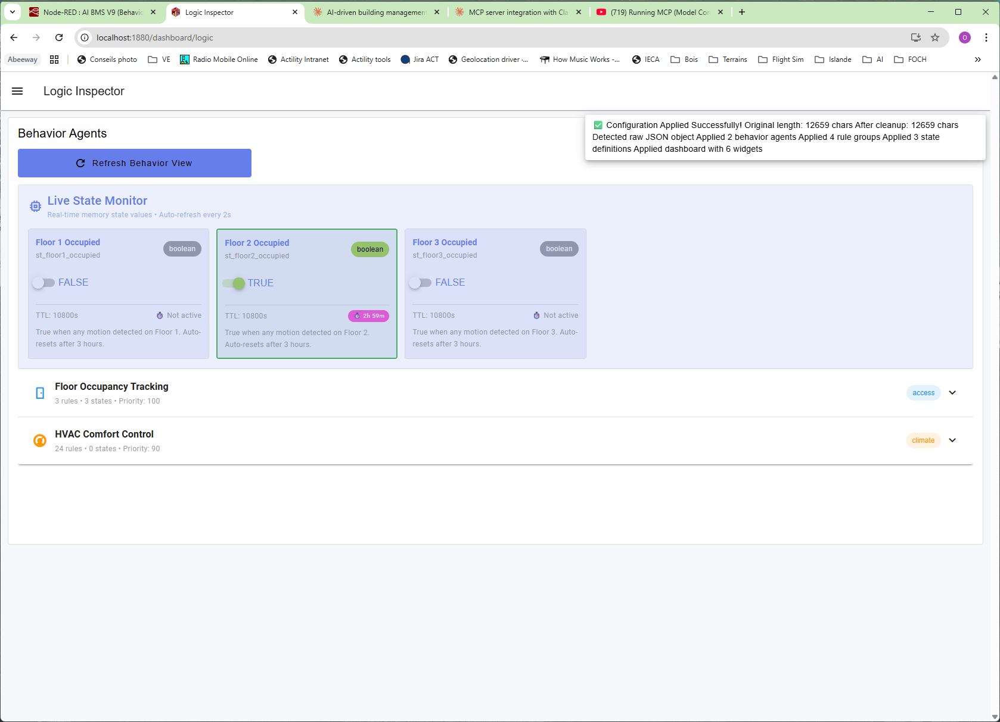
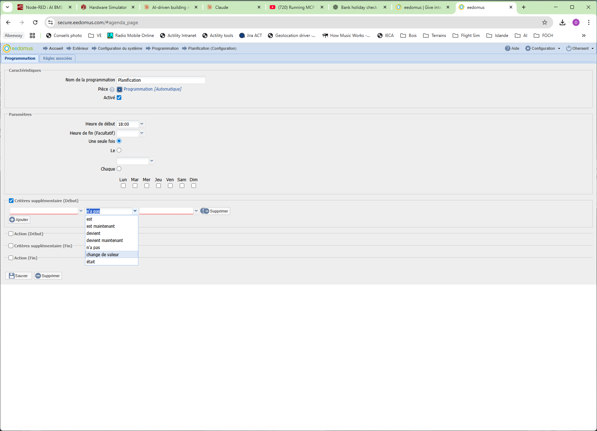
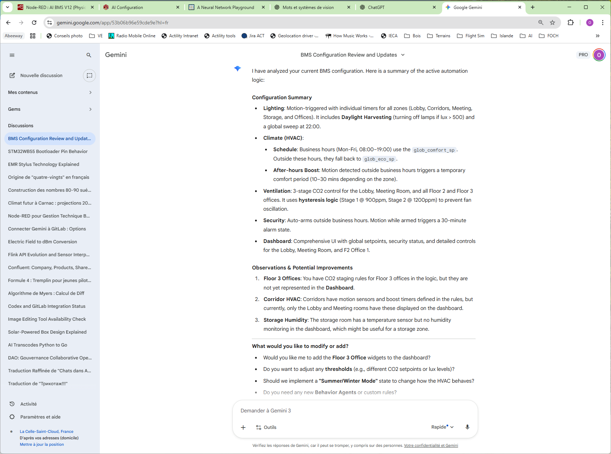
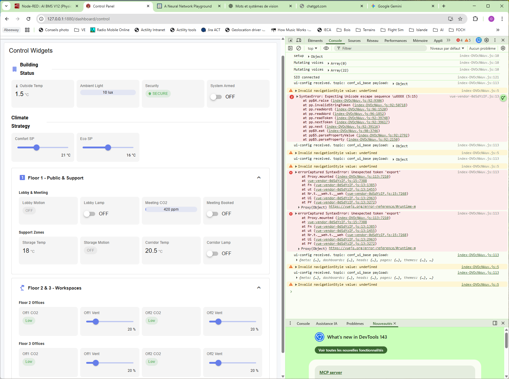

# AI BMS — Historical Documentation (V5 era, Nov 2025)

> **Status: historical.** Converted from `AI_BMS_documentation.docx` (deleted) on
> 2026-06-12, lightly curated: secrets redacted, bulk obsolete example-rule JSON
> omitted, each section annotated with its V12.1 status. Current references:
> `handover/AI_BMS_Project_Handover.md` (architecture), `docs/BMS_CONFIG_SCHEMA.md`
> (schema + API), `audit/2026-06-12_audit.md` (issue statuses).
>
> Historically interesting: this document is where the **"93 data points / 11 rooms"**
> figures originate (true for V5's `bacnetStore`; V12.1 reality is 86 BACnet points /
> 13 zones), and §"Pending Issues" item 2 is the original design sketch of the
> `bacnetPoints`/`bmsMetadata` separation that V12 implemented. The **Brainstorm**
> section at the end is still a live ideas backlog.

---

## Setting up MCP *(superseded — see `.mcp.json` in the repo root)*

The original setup targeted **Claude Desktop on Windows** calling into WSL. The
project now uses Claude Code with the project-scoped `.mcp.json` instead; the Admin
API token setup remains valid.

### Step 1: Enable Node-RED Admin API in WSL

`nano ~/.node-red/settings.js` — note that the `node-red admin hash-pw` tool may
generate PHP-style bcrypt hashes (`$2y$`) while Node-RED expects Node.js-style
(`$2b$`). The algorithms are 100% compatible — just change the prefix manually.

```js
adminAuth: {
    type: "credentials",
    users: [{
        username: "admin",
        password: "<bcrypt hash — generate with: node-red admin hash-pw>",
        permissions: "*"
    }],
    tokens: [
        {
            token: "<long random string — openssl rand -hex 32>",
            user: "admin",
            scope: ["*"]
        }
    ]
},
```

Restart Node-RED.

### Step 2: Install MCP Node-RED Server in WSL

```bash
sudo npm install -g node-red-mcp-server
```

### Step 3: Configure Claude Desktop *(obsolete — kept for reference)*

In `C:\Users\{YourUsername}\AppData\Roaming\Claude\claude_desktop_config.json`
(Settings → Developer → Edit file):

```json
{
  "isUsingBuiltInNodeForMcp": false,
  "mcpServers": {
    "node-red": {
      "command": "wsl",
      "args": [
        "-e", "bash", "-c",
        "export NODE_RED_URL=http://localhost:1880 && export NODE_RED_TOKEN=<token> && npx -y node-red-mcp-server"
      ]
    }
  }
}
```

---

## Additional nodes *(still accurate)*

### OpenWeather
- Install `node-red-node-openweathermap` from the palette.
- Configure the API key in the node credentials (not exported with flows; re-enter
  after a clean import).

---

## Running the Node-RED app *(still accurate, V12.1 notes added)*

- Run the Microsoft **Terminal** app (manages CTRL-C/V better across Windows/Linux).
- WSL: start VM support in Windows.
- `cd ~/.node-red`
- Remove any flows: `rm flows.json` *(V12.1: copy the repo's `flows.json` instead)*
- Start `node-red`
- Editor: `http://127.0.0.1:1880/` — import the flows.
- Dashboard: `http://localhost:1880/dashboard/`

---

## 1. Project Intent: The "No-Code" AI BMS *(unchanged in spirit — still the project's north star)*

Replace the complex, static configuration interfaces typical of Building Management
Systems (Niagara, EcoStruxure) with a **Generative AI Workflow**. Instead of manually
dragging wires or writing script code, the user interacts via natural language:

1. **Context Awareness**: the system exports its current state (hardware inventory + active rules) to the AI.
2. **Natural Prompting**: the user tells the AI what they want ("Turn off heating if the window is open for 10 minutes").
3. **Code Generation**: the AI generates a standard JSON configuration.
4. **Hot-Reloading**: Node-RED ingests the JSON, sanitizes it, and instantly updates its logic engine and dashboard without a restart.

*(V12.1: the "context export → paste → generate → paste back" loop is replaced by the
BMS HTTP API for engineering use; the in-dashboard chat is the next step.)*

---

## 2. System Architecture — V5 context handoff *(superseded by handover §3–§4; kept as historical record)*

### Test environment: 3-floor office building

The V5 simulated building had **93 data points across 11 rooms** *(V12.1: 86 points,
13 zones incl. External)*:

- **Floor 1** — Lobby: temp, humidity, CO2, motion, light level, lights (BO), valve (AO); Corridor: temp, motion, light level, lights, valve; Meeting Room: + booking status; Storage: temp, motion, lights, valve.
- **Floors 2 & 3** — 3 offices each (temp, humidity, CO2, motion, light level, lights, valve) + corridor.
- **Global** — comfort/eco setpoints (AV), current hour, day of week, outside temp, outside light level.

Data point types (BACnet convention): AI = Analog Input (read-only), BI = Binary
Input, AO = Analog Output (read-write), BO = Binary Output, AV = Analog Value.
*(V12.1 models access as `read_only`/`read_write` + units instead of object types.)*

### V5 flow groups *(V12.1 has 11 groups — see handover §3)*

1. **LOGIC KERNEL** — 1s Heartbeat → Build Facts → JSON Rules Engine → Event Router → State Manager / Group Resolver / Safety Guard. *(Structure survives unchanged into V12.1.)*
2. **DASHBOARD ENGINE** — Merge Config + Data → Dynamic Widget Renderer (Vue.js) → Filter User Input.
3. **HARDWARE SIMULATOR** — digital twin with interactive sliders/switches.
4. **AI Prompt Generator** — exports system context as a structured prompt.
5. **AI Configuration Ingestor** — paste form → extract → Parse & Apply.
6. **Behavior Agents UI** — logic inspector.

*(Added since V5: PHYSICS SIMULATOR, VIRTUAL POINTS (Sun/Time), WEATHER INTEGRATION,
DEVICE MANAGER, BMS API.)*

### V5 data structures *(superseded — note the monolithic `bacnetStore`)*

```js
// V5: hardware + metadata mixed in one store
global.get('bacnetStore') = {
  "f1_lobby_temp": {
    id: "f1_lobby_temp", name: "Lobby Temperature", type: "AI",
    tags: ["floor1", "lobby", "public"], access: "read_only",
    value: 21, unit: "°C"
  } // ... 93 points total
}
```

`behaviorAgents` (with `priority`), `ruleGroups` (json-rules-engine format),
`stateRegistry` (TTL soft states), `myStateCache` (NodeCache), `dashboardConfig`
(text|slider|switch only at the time).

Dependencies (settings.js): `nodeCacheModule`, `jsonRulesEngine` *(suncalc came later;
V12.1 key is `suncalcModule`)*. Dashboard: `@flowfuse/node-red-dashboard` v1.29.0.

### Bugs fixed in that era
| Issue | Fix applied |
|---|---|
| Hardware Simulator not auto-refreshing | `sim_auto_refresh` repeat "" → "2" |
| No immediate UI feedback on sensor toggle | wired `sim_write_sensor` → `sim_build_ui` |
| Rule names mutating over time | clone rule object before renaming in the engine |

### Pending issues listed in V5 — where they ended up
1. **Group Resolver missing BO type** → obsolete (V12 resolver is unit/access-based, not type-based).
2. **BACnet/BMS separation of concerns** → **implemented in V12** as `bacnetPoints` / `bmsMetadata` + the `BMS` abstraction API; the proposed function list (`BACnetReadAll`, `BMSQueryByTags`…) became `BMS.getValues/getValue/writeValue/getMetadata` and, in V12.1, the `/bms/*` HTTP endpoints.
3. **`°C` encoding issues** → fixed.
4. **Incomplete AI-generated rules** (lights never turn off, missing floors, dangling states) → addressed by the prompt's anti-pattern guidance (hysteresis stage-checks, timer patterns) and apply-time unknown-fact validation.
5. **Dashboard control panel validation** → `BMS.writeValue` enforces access + min/max clamping.

---

## LLM Automated Prompt + Examples *(superseded by "Build AI Prompt (Interactive)" and `docs/BMS_CONFIG_SCHEMA.md`)*

The original document contained a sample generated system prompt and two worked
examples with full AI-generated JSON in the **V5 schema** (`behavior_agent` links on
states, agent `priority`, `grp_*` ids):

- **Presence-based heating control** — "set a global `floor_N_occupied` state for each
  floor, set for 3 hours each time motion is detected on that floor; rooms go Comfort
  when occupied, Eco otherwise." (Floor-level occupancy aggregation via `any`
  conditions over motion sensors; 3 h TTL; valve writes per room.)
- **Add lighting control** — motion-activated lighting with auto-off timers.
- **Example comprehensive ruleset** — a full-building config (~900 lines of JSON).

The verbatim JSON (~1,400 lines) was omitted from this conversion: it uses the
obsolete V5 schema and point types and would mislead more than help. The *scenarios*
remain excellent demo material — reimplement them through `/bms-apply` in minutes.

Screenshots of the presence-heating example running (Logic Inspector with the three
floor-occupancy states, config-applied toast):





---

## Brainstorm *(still live — feature ideas backlog)*

- Add calendar access (holidays / working days + "xx hours ahead", "journée de demain"), sunrise/sunset, external temperature. *(sun + outside temp: done in V12)*
- Add external temperature virtual sensor *(done)*
- **Wizards** (one-click rule templates):
  - Pre-heating in the morning
  - Switch on all lights / switch off all lights
  - Light on motion
  - Light on timer
  - Light when no sun
  - Presence simulation
  - Open all stores (blinds) / close all stores
  - Alert on intrusion
  - Automated on-off (e.g. coffee machine)
  - Auto VMC (ventilation) off when a window is open
- Calendars (reference UI: eedomus scheduler — start/end time, one-shot/weekly, extra criteria):

  

- Rules editor sketch — `<data>` | is / is now / becomes / changes value — was | `=`, `<`, `>`, `!=`, compare to peripheral value…:

  

## Gemini screenshots *(UI inspiration — Gemini reviewing a BMS configuration)*



